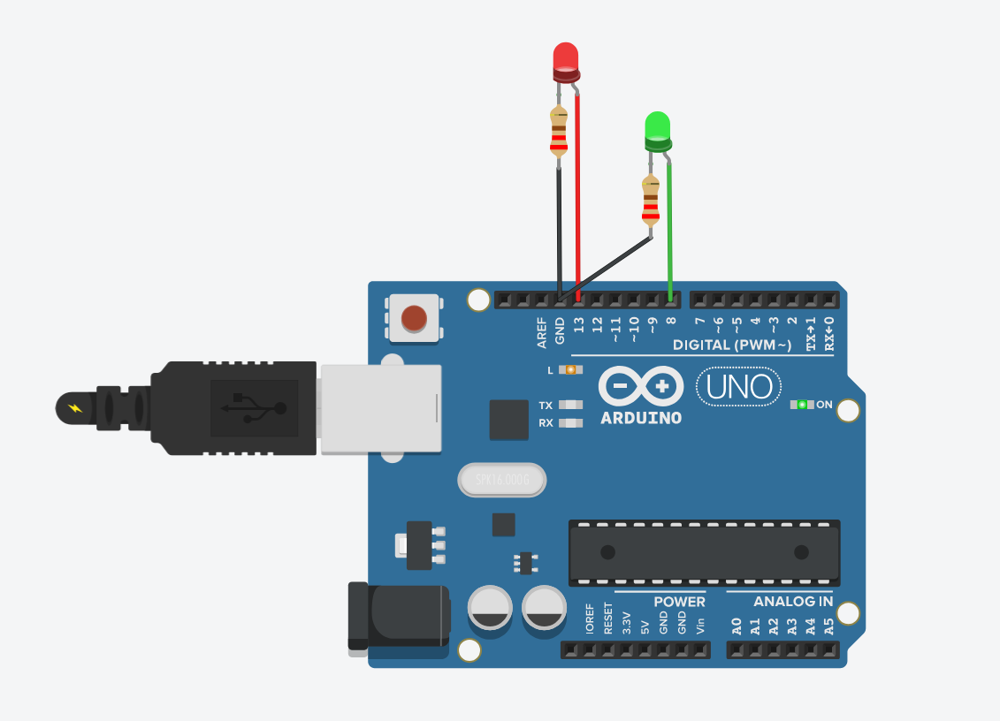

# INTERFAZ II
------------------------------------------------

#####  Ejercicio n° 1  : Hola Mundo!

``` js

void setup() {
  Serial.begin(9600); // Inicia la comunicación serie a 9600 bps
  Serial.println("Hola, Mundo!"); // Envía "Hola, Mundo!" al monitor serie
}

void loop() {
  // No es necesario poner nada en el loop para este ejemplo
}

```
##### Ejercicio n°2 Led parpadeante 

``` js
// C++ code
//
void setup()
{
  pinMode(13,OUTPUT);
  pinMode(8,OUTPUT);
  pinMode(LED_BUILTIN, OUTPUT);
}

void loop()
{
  digitalWrite(13, HIGH);
  
  delay(500); // Wait for 1000 millisecond(s)
  digitalWrite(8, HIGH);
  delay(500); // Wait for 1000 millisecond(s)
  digitalWrite(13,LOW);
  delay(500); 
  digitalWrite(8, LOW) ;
  
  delay(500); 
  
  
}

```
 Led Parpadeante </a>

##### Ejercicio n°3 Pulsador
``` js
void setup() {
  pinMode(2, INPUT);  // Botón como entrada
  pinMode(13, OUTPUT);
}
void loop() {
  if (digitalRead(2) == HIGH) {  // Si se presiona el botón
    digitalWrite(13, HIGH);
  } else {
    digitalWrite(13, LOW);
  }
}


```
<a href="img/3Pulsador.png" > Pulsador </a>
##### Ejercicio n°4 Potenciómetro
``` js
int potPin = A0;  // Pin analógico donde está conectado el potenciómetro
int potValue = 0; 

void setup() {
  pinMode(9, OUTPUT);  // Pin PWM (símbolo ~)
  Serial.begin(9600);
}
void loop() {
  int valor = analogRead(A0);           // Leer potenciómetro (0-1023)
  int brillo = map(valor, 0, 1023, 0, 255);  // Convertir a rango PWM
  analogWrite(9, brillo);               // Ajustar brillo

  
  potValue = analogRead(potPin); // Lee el valor del potenciómetro
  Serial.print("Valor del potenciómetro: ");
  Serial.println(potValue); // Imprime el valor en el Monitor Serial
  delay(100); // Espera 100m

}


```
<a href="img/4Potenciómetro.png" > Potenciómetro </a>
##### Ejercicio n°5 : Semáforo
```js
// C++ code - Semáforo Autos y Peatones

// Definición de pines
int LED_1 = 6;  // Luz roja autos
int LED_2 = 7;  // Luz amarilla autos
int LED_3 = 8;  // Luz verde autos
int LED_4 = 9;  // Luz verde peatones
int LED_5 = 10; // Luz roja peatones

void setup() {
  // Configuramos todos los pines como salida
  pinMode(LED_1, OUTPUT);
  pinMode(LED_2, OUTPUT);
  pinMode(LED_3, OUTPUT);
  pinMode(LED_4, OUTPUT);
  pinMode(LED_5, OUTPUT);
}

void loop() {
  // 🚦 Fase 1: Autos en verde, peatones en rojo
  digitalWrite(LED_1, LOW);   // Rojo autos apagado
  digitalWrite(LED_2, LOW);   // Amarillo autos apagado
  digitalWrite(LED_3, HIGH);  // Verde autos encendido
  digitalWrite(LED_4, LOW);   // Verde peatones apagado
  digitalWrite(LED_5, HIGH);  // Rojo peatones encendido
  delay(5000); // 5 segundos

  // 🚦 Fase 2: Amarillo autos, peatones siguen en rojo
  digitalWrite(LED_3, LOW);   // Verde autos apagado
  digitalWrite(LED_2, HIGH);  // Amarillo autos encendido
  delay(2000); // 2 segundos
  digitalWrite(LED_2, LOW);   // Amarillo autos apagado

  // 🚦 Fase 3: Rojo autos, verde peatones
  digitalWrite(LED_1, HIGH);  // Rojo autos encendido
  digitalWrite(LED_5, LOW);   // Rojo peatones apagado
  digitalWrite(LED_4, HIGH);  // Verde peatones encendido
  delay(5000); // 5 segundos

  // 🚦 Fase 4: Rojo autos, rojo peatones (tiempo intermedio)
  digitalWrite(LED_4, LOW);   // Verde peatones apagado
  digitalWrite(LED_5, HIGH);  // Rojo peatones encendido
  delay(2000); // 2 segundos
}
```

<a href="img/5Semáforo.png" > Semáforo </a>


